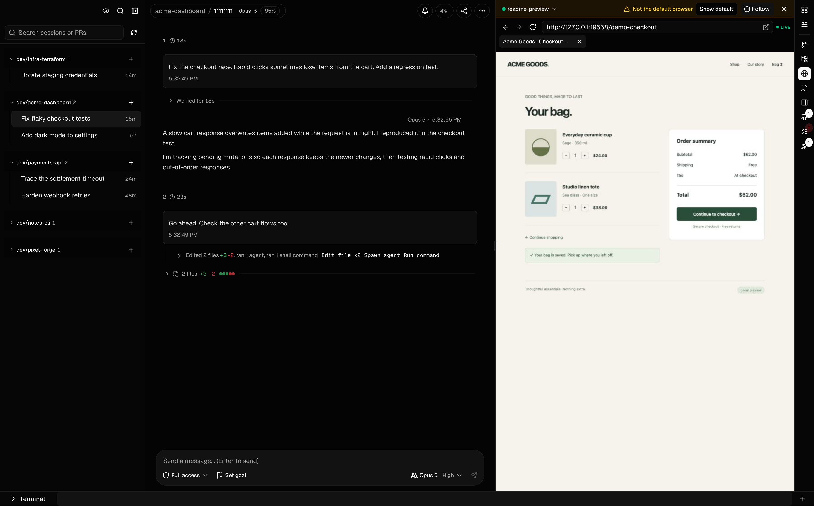
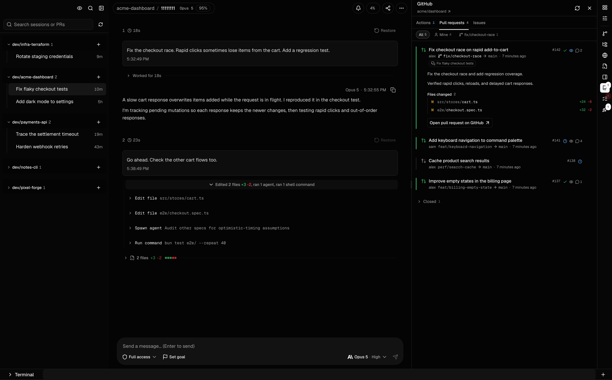
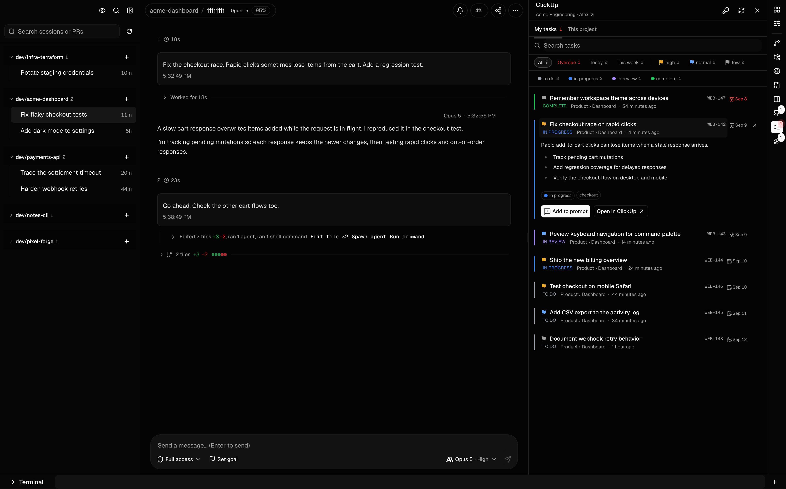
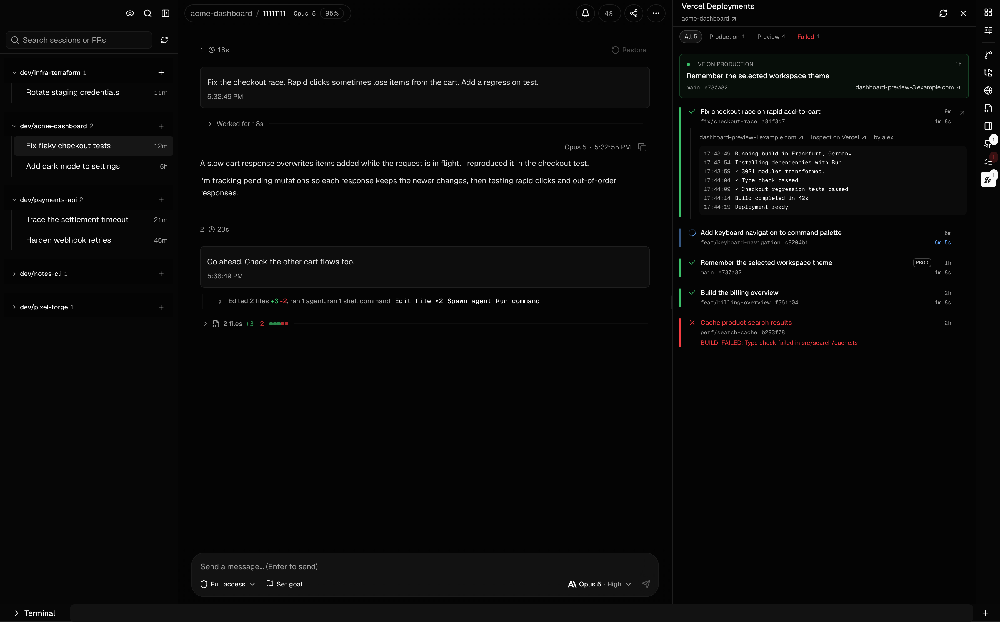

<h1 align="center">Cogpit</h1>

<p align="center"><strong>Your coding agents, in one workspace.</strong></p>

<p align="center">
  An open-source GUI for Claude Code, OpenAI Codex, and GitHub Copilot CLI.<br />
  Run sessions, review code changes, and use the browser alongside your agents.
</p>

<p align="center">
  <a href="https://github.com/gentritbiba/cogpit/releases/latest">Download Cogpit</a> ·
  <a href="#get-started">Get started</a> ·
  <a href="docs/usage.md">Documentation</a> ·
  <a href="https://cogpit.dev">Website</a>
</p>



<p align="center"><sub>The current Cogpit interface, captured at 3600 × 2240. All screenshots use demo sessions and sample project data.</sub></p>

Cogpit gives your AI coding agents a shared workspace on macOS, Windows, and Linux. Start a session with your preferred CLI, follow its work, and keep the conversation beside the files it changes. Switch between projects without losing the thread.

It runs on your machine and uses your existing CLI logins. Cogpit is free, MIT-licensed, and available as a desktop app or a local web app.

## Keep the work in view

- Follow live conversations, tool calls, and recorded subagent activity. Expand a command to see its output or an edit to see its diff.
- Resume existing Claude Code, Codex, and Copilot CLI sessions. Find them by project, prompt, branch, or pull request. A live session list shows what is running and what needs your attention.
- Review every file an agent touched. Open files in the built-in editor, inspect changes by turn, or compare the session's combined diff.
- Open the Browser panel to watch and interact with the browser your agent is using. Take over a login or check a page together, then let the agent continue. The shared default browser and named browser sessions keep their logins between runs.
- Keep terminals, project scripts, and GitHub pull requests beside the chat. GitHub, ClickUp, and Vercel panels bring their status into the workspace.
- Inspect token usage and available account limits. See published-price cost estimates when the provider exposes enough data.
- Revisit an earlier turn and try another approach. Branching, rewind, and file restoration follow each CLI's supported controls.
- Connect another machine or open Cogpit from your phone. Answer an agent without sitting at the computer running it.

## Get started

Install and sign in to at least one supported CLI: [Claude Code](https://docs.anthropic.com/en/docs/claude-code), [OpenAI Codex](https://github.com/openai/codex), or [GitHub Copilot CLI](https://docs.github.com/en/copilot/how-tos/copilot-cli/set-up-copilot-cli/install-copilot-cli). Cogpit uses that CLI's authentication and access to models.

### Download the desktop app

Get the installer from the [latest release](https://github.com/gentritbiba/cogpit/releases/latest).

| Platform | Download |
| --- | --- |
| macOS, Apple Silicon | `Cogpit-<version>-arm64.dmg` |
| macOS, Intel | `Cogpit-<version>.dmg` |
| Windows, x64 | `Cogpit-<version>-setup.exe` |
| Linux | `.AppImage` or `.pacman` |

The Windows installer is unsigned and Windows support has had less testing. SmartScreen may show an unknown-publisher prompt. Use **More info → Run anyway** to open the installer.

### Run in your browser

With Node.js 20.11 or newer:

```bash
npx cogpit@latest
```

This starts a local server on an available loopback port and opens Cogpit in your browser. Press `Ctrl+C` to stop it. To open a single existing session:

```bash
npx cogpit@latest preview <session-id>
```

See [launcher options](packages/cogpit-cli/README.md) or the [self-hosting guide](docs/self-hosting.md) for a headless server and remote access.

## Claude Code, Codex, and Copilot support

Cogpit connects to the installed agent CLIs. The controls in a session reflect what that CLI supports.

| Agent | What you can do in Cogpit |
| --- | --- |
| Claude Code | Start and resume chats, choose models, answer approvals, inspect subagents, set goals, undo and redo edits, and share a live session with a guest. |
| OpenAI Codex | Start and resume threads, choose models and reasoning effort, steer active turns, answer native approvals, inspect subagents, and track goals with optional token budgets. |
| GitHub Copilot CLI | Discover existing sessions, start and resume chats, choose models, answer approvals, and use native fork and rewind, including optional file restoration. |

[Read the agent-specific details](docs/usage.md#agent-support) for limits on sharing, history controls, and configuration.

## From task to pull request to preview

### GitHub pull requests and Actions

Check pull request status, reviews, changed files, and Actions runs beside the conversation. Jump back to the session linked to a pull request.



### ClickUp task context

Browse your tasks, filter by status or due date, and add a task to the agent's prompt without retyping its requirements.



### Vercel deployments

See production and preview deployments, inspect build logs, and open the preview you need to check. Use the Browser panel above to inspect the page with your agent.



These panels use the services you connect in Cogpit. See [integration setup](docs/plugins.md) and [Browser panel setup](docs/browser.md), including persistent sessions and platform support.

## Common questions

### Can I use Cogpit as a Claude Code GUI or Codex GUI?

Yes. Cogpit is a desktop and browser interface for Claude Code and OpenAI Codex. It reads their local session history and connects to their runtimes so you can continue conversations, respond to approval requests, and review code changes in the same window.

### Does Cogpit work with GitHub Copilot?

Cogpit supports GitHub Copilot CLI sessions. It does not import VS Code Copilot Chat history. Install and authenticate Copilot CLI before starting a Copilot session in Cogpit.

### Can I run multiple AI coding agents in one app?

Yes. Keep sessions from Claude Code, Codex, and Copilot CLI in the same Cogpit workspace, grouped by project. Each session uses its selected CLI. Cogpit also displays recorded subagent work when the provider exposes it.

### Do I need a separate API key or subscription?

Cogpit does not require a Cogpit account, API key, or paid subscription. It uses your existing agent CLI login. The agent provider's own subscription, API charges, and usage limits still apply.

### Where does my session data go?

Cogpit reads session history from the CLI directories on your machine. It does not upload that history to a Cogpit cloud service. Your agent CLI still sends requests to its model provider. Optional remote access, session sharing, and integrations communicate with the services you configure.

### Can I use Cogpit from my phone or self-host it?

Yes. Run the desktop app with Network Access enabled or run a headless Cogpit server, then connect through your phone's browser. Remote browser access requires HTTPS and authentication. The multi-device hub lets you switch between registered machines. See [self-hosting and remote access](docs/self-hosting.md).

## Build from source

```bash
git clone https://github.com/gentritbiba/cogpit.git
cd cogpit
bun install
bun run dev
```

Use `bun run electron:dev` for the desktop app, `bun run build:web` for the web build, or `bun run electron:package` for a local desktop package. See the [development guide](docs/development.md) for checks and packaging details.

React, TypeScript, Vite, Electron, Tailwind CSS, and Express. [Architecture](ARCHITECTURE.md) explains how Cogpit connects to each agent.

## Documentation

- [Using Cogpit](docs/usage.md): session controls, history, file changes, goals, and notifications.
- [Browser panel](docs/browser.md): shared browsing, persistent logins, and setup.
- [Self-hosting](docs/self-hosting.md): headless servers, HTTPS, and authentication.
- [Integrations and plugins](docs/plugins.md): GitHub, ClickUp, Vercel, and custom panels.
- [cogpit-memory](packages/cogpit-memory/README.md): search and inspect agent sessions from the command line.

## License

[MIT](LICENSE)
