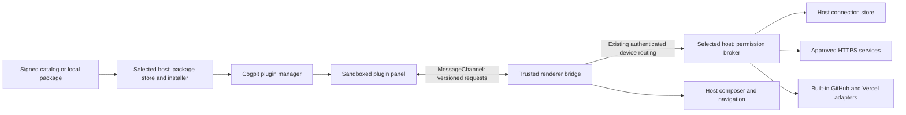

# Runtime-installable Cogpit plugins

Status: architecture reviewed; local implementation and validation for phases 0 through 4 and 5b passed on 2026-09-14/15. The existing ClickUp, GitHub and Vercel panels now install onto the connected host and render in the same right sidebar. Phase 5a catalog/publisher tooling is deferred by the latest user steering; Phase 6 Cloudflare/Figma is excluded. No public publication or installed-app replacement occurred. Windows and oldest-browser execution remain release verification.

Date: 2026-09-14.

User decisions: install through Cogpit's UI onto the selected Cogpit host. Browsers and desktop clients connected to that host share its installed packages. The requested deliverable for this pass is the reviewed architecture and implementation plan. Cloudflare and Figma are the next intended integrations. Local implementation evidence is recorded separately below; proposed behavior throughout this document is not a claim that it has all shipped.

| Decision | Recommendation |
| --- | --- |
| Installation | Host-owned, through the UI; signed local-file install first, catalog afterward. |
| Defaults and migration | Fresh hosts start without optional integrations installed. Existing hosts retain the three current integrations through one-time migration. Every optional plugin supports disable and uninstall. |
| Execution | Sandboxed browser panel with a versioned message API; no downloaded server code. |
| Compatibility | Check actual client, selected host, public API/capabilities and persisted formats separately. |
| Provider access | Host-owned credentials and bounded operations declared by each package. |
| Updates | Manual by default, exact-byte permission review, provisional trial, atomic cutover. |
| Rollback | Preserve current data; reject incompatible state-schema changes in v1. |
| Initial trust | Official signed packages and explicitly enrolled development publishers. |
| First acceptance milestone | Install a separately built sample panel on a remote host, use it, restart, disable and uninstall without rebuilding Cogpit. |
| Next integrations | Cloudflare/Figma follow the runtime/provider/update gates; legacy GitHub/Vercel migration need not delay them. |

The current optional integrations are GitHub, ClickUp and Vercel. Make all three independently installable. For new hosts, list them in Browse with an Install action and no preselected installs. Preserve existing users' integrations during upgrade, then give them Disable and Uninstall. Keep installation, enablement and account connection as separate states. Disabling stops plugin activity while retaining settings; uninstall retains data unless the user explicitly chooses deletion. Removed plugins must stay removed after an app update. Files, Browser, Diffs and other core workspace tools remain built in.

Current implementation boundary: ClickUp has a separately built runtime package and the host installer works locally. GitHub and Vercel still use their existing source imports and are not yet installable runtime packages. Catalog distribution, complete update/recovery acceptance, the two remaining migrations, and Cloudflare/Figma packages remain follow-up phases. The application must not be presented as having finished the optional-plugin conversion until those migration gates pass.

## 1. Product contract

Fresh Cogpit hosts start without optional integration packages installed. The plugin browser lists the official integrations without executing them or creating connections. A user opens Plugins, sees the selected host, chooses an integration, reviews what it can access, and installs it. Its panel becomes available without rebuilding or restarting Cogpit. The user can configure, disable, update, pin, roll back, and uninstall it from the same screen. A failed plugin does not prevent ordinary application startup.

Installation belongs to the selected host, not the current browser, Git checkout, active session, or hub by accident. An installation on MacBook is distinct from one on agentbox. Switching hosts changes the plugin list and connections. Project associations belong to the selected host's canonical project identities. Package availability is host-wide; workspace visibility can be scoped to a project. By default a new installation is enabled for the current project only; the install dialog can explicitly choose all projects. With no project selected it installs without enabling panels until a project scope is chosen. Updates and uninstall affect every project/client on that host; the UI states this explicitly.

The first supported runtime runs plugin JavaScript in a sandboxed browser frame. The Cogpit server stores packages and brokers explicitly granted operations. It does not execute downloaded Node.js code. This supports the next Cloudflare and Figma integrations through HTTPS without adding their provider-specific backend routes to Cogpit.

Initial distribution supports official signed plugins and a clearly marked local development mode. Public community publishing is a later distribution-policy feature using the same package format. Arbitrary URL installation, npm lifecycle scripts, native addons, general shell execution, plugin-to-plugin dependencies, and background agent turns are outside version 1.

## 2. What exists and why a dynamic import is insufficient

Verified against the working tree on 2026-09-14:

| Existing code | Consequence |
| --- | --- |
| `plugins/index.ts` imports GitHub, ClickUp, Vercel; `src/plugins/registry.ts` builds a module-level panel array. | Both the registry and workspace subscription must become dynamic. |
| `src/plugin-api/index.ts` exports host React components and `authFetch`; `WorkspacePanelContext` includes `ParsedSession`. | This is a source-code convention, not an isolation boundary. Downloaded code must not inherit the whole session, app DOM, authenticated fetch, or internal React ABI. |
| `WorkspaceActivityBar.tsx` invokes plugin callbacks and mounts panel components in the application tree. | Runtime manifests need data-only contributions and host-owned wrappers, including per-panel error UI. |
| GitHub, Vercel, ClickUp backend handlers are core routes. | Installing a panel alone does not install arbitrary server functionality. A stable broker is needed. |
| `authFetch`, `withBase`, `DeviceRoot` implement device routing and identity/revision remounts. | Plugin caches, activation leases, async responses and settings must follow those scopes. |
| `/api/hello` reports the server app version and `hubApi: 1`; client `ServerHello` only models edition/bootstrap. | Plugin compatibility needs an explicit authenticated target-host handshake rather than inference from the renderer's app version. |
| Existing plugin routes require admin in `server/team/policy.ts`; shared sessions use a separate default-deny allowlist. | Version 1 retains admin-only plugin use and management in team mode. Share guests receive no plugin inventory, packages, credentials or operations. |
| `server/security.ts` sets `X-Frame-Options: DENY`, `frame-ancestors 'none'`, and a restrictive CSP. | A reviewed, narrowly scoped runtime-frame policy is required. Globally weakening CSP is unacceptable. |
| Electron uses sandbox/context isolation, but forwards external navigation to `shell.openExternal`. | Runtime frames must not reach Electron preload APIs or cause arbitrary protocol launches. |
| Atomic JSON helpers exist, but callers own mutation serialization; ordinary request bodies are bounded. | Installation needs a durable transaction protocol and bounded binary transport, not several independent JSON writes. |

The three current integrations and their source-verified dependency paths are recorded in `.claude/deployments.md` and the global deployment index. No new live provider account or infrastructure has been verified in this task.

## 3. Architecture decision



Rejected alternatives:

- Import arbitrary ESM into the main React tree: simplest packaging, but the plugin has the app's ambient authority, CSS can affect the app, and React/component versions become a compatibility obligation.
- Download and load Node modules in the server: arbitrary host execution, native dependency/platform conflicts, and restart/disposal problems. A child process is not an adequate security sandbox by itself.
- Browser-local installations: duplicate state and credentials across clients and do not match the user's selected-host decision.
- A new marketplace service or general backend extension host first: neither is required for the first integrations. Start with static distribution and a finite broker API.

### Browser boundary

Use a trusted, versioned runtime document shipped with the renderer, embedded with `sandbox="allow-scripts"`. Do not add `allow-same-origin`, popup, form, download, or top-navigation grants. The frame runs bundled plugin JavaScript and its own UI dependencies. It cannot import `@/plugin-api`, read parent storage/DOM, or access the parent's Electron bridge. Framework-free plugins and bundled React plugins use the same message protocol. The SDK's UI components are compiled into the plugin, not shared as a singleton with Cogpit.

The runtime document is a dedicated same-origin shell route with a response CSP `sandbox allow-scripts`, a narrowly allowed hashed bootstrap, and controlled blob execution. Package code is never served as an executable same-origin application page. Package assets are authenticated bytes fetched by the trusted parent, digest checked, then delivered through a bound MessageChannel. CSS and raster images are local package bytes; no CDN imports or arbitrary HTML documents. The parent retains the restrictive app CSP, except for the explicit frame route it embeds. The shell's framing exception must work in Vite, Electron, standalone and the packaged npm server without opening other endpoints to framing.

Direct entry to the shell stays sandboxed because the restriction is also an HTTP response header. Prevent package routes from falling through to static-file or SPA serving. Bootstrap and package loaders require an implementation spike in real Chromium and WebKit before declaring this design ready to ship; inherited CSP, blob execution, CORP and opaque-origin messaging must be tested together, not inferred from jsdom.

Connect one MessageChannel to the exact frame window with a fresh nonce. An opaque frame's `event.origin` is `null`, which is not an identity check. Verify `event.source`, the pending activation and the handshake nonce; transfer the channel once, then ignore global messages. Do not include host credentials or the server activation lease in messages to the plugin. Bind every request to plugin ID, package digest, principal, host connection revision, session/project context epoch, and current grants using parent/server state, never fields trusted from the plugin. Revoke channels and leases on navigation, logout, disable, uninstall, project switch, host switch, or connection replacement.

CSP blocks routine direct fetch/image/font/form channels, but a browser frame is not a promise that malicious code cannot transmit information already granted to it. Frame self-navigation and engine-specific behavior need explicit tests; no policy will claim perfect network confinement or hard CPU isolation. Version 1 only runs trusted official packages in normal mode. Safe mode and recovery cover failures, but an infinite loop may still make a tab unresponsive. Untrusted community execution is not an implied security guarantee.

Evidence: browser sandbox and messaging rules are documented by [MDN iframe](https://developer.mozilla.org/en-US/docs/Web/HTML/Reference/Elements/iframe), [CSP sandbox](https://developer.mozilla.org/en-US/docs/Web/HTTP/Reference/Headers/Content-Security-Policy/sandbox), and [postMessage](https://developer.mozilla.org/en-US/docs/Web/API/Window/postMessage). Electron's [security guidance](https://www.electronjs.org/docs/latest/tutorial/security) supports retaining isolation and denying downloaded code native access. The limitations and exact loading mechanism above are design decisions requiring the spike, not claims of a tested runtime.

## 4. Package and SDK contracts

Use a `.cogpit-plugin` install bundle containing a payload archive and its signed trust metadata. Version 1 uses a strict JSON envelope with base64 payload bytes; its JSON payload archive contains a bounded array of path, MIME and base64 content records. Compression and filesystem extraction are unsupported. This trades base64 size overhead for a finite format with no links, archive extensions or executable install hooks. Raw JSON duplicate keys and malformed Unicode are rejected before schema validation. The payload contains `plugin.json`, one self-contained browser JavaScript entry, one optional stylesheet, local assets, license and notices. Catalog distribution and offline installation refer to the same payload digest. The bundle's metadata is outside that payload to avoid a circular hash. Only this fixed envelope/payload nesting is supported, not general recursive archive extraction. No installation-time compilation, dependency fetching, scripts, native binaries or executable server entry. The host never runs the archive's `package.json` scripts. Development sources may use Bun, but installation requires neither Bun nor a package manager.

Initial limits: 4 MiB for the complete upload, 16 MiB total expanded across envelope and payload, 256 files, 64 KiB manifest. A raw binary upload fits below the existing 5 MiB outer request ceiling. The hub currently buffers requests to replay authentication retries, so keep the cap rather than adding a large-upload exception. Enforce limits while reading, not after buffering. Reject absolute paths, dot segments, symlinks/hardlinks, duplicate or case-colliding paths, special files, unsupported compression, invalid entry paths and excessive expansion. File MIME types and data-only icons are validated. All package paths stay inside staging, with platform-specific Windows path/rename tests.

Illustrative manifest, with API names proposed rather than already implemented:

```json
{
  "manifestVersion": 1,
  "id": "cogpit.figma",
  "publisher": "cogpit",
  "name": "Figma",
  "version": "1.0.0",
  "runtime": "browser-iife-v1",
  "entry": "dist/plugin.js",
  "style": "dist/plugin.css",
  "engines": {
    "pluginApi": "^1.0.0",
    "client": ">=2.7.0",
    "host": ">=2.7.0"
  },
  "requires": {
    "client": { "workspace.panel": "^1.0.0", "composer.append": "^1.0.0" },
    "host": { "connections.request": "^1.0.0", "storage.json": "^1.0.0" }
  },
  "contributes": {
    "panels": [{ "id": "designs", "title": "Figma", "icon": "assets/icon.png" }]
  },
  "permissions": {
    "context": ["project.identity"],
    "composer": ["append"],
    "connections": [{ "id": "figma", "definition": "connections/figma.json", "operations": ["file.read", "nodes.read", "images.render"] }],
    "storage": { "scope": "project", "quotaKiB": 256 }
  },
  "stateVersion": 1
}
```

Version 2.7.0 above is an example release floor, not an assigned release/tag. Real package metadata must use the first release that passes these gates. Connection declarations follow the bounded contract in section 6. Optional capabilities and browser prerequisites must also be defined in the schema before implementation.

Unknown manifest majors, unknown required permissions, malformed semver and unsupported runtimes fail closed. Optional capabilities have explicit fallbacks. IDs use publisher-qualified names with reserved built-in namespaces. The signer must own the publisher namespace; an archive's self-declared publisher string establishes nothing. No inter-plugin dependencies in v1: each package bundles its own dependencies and license notices.

Create `packages/plugin-contracts` as the canonical browser-safe schema/protocol package, `packages/plugin-sdk` for the frame-side API and author helpers, and optionally `packages/plugin-ui` for reusable styles/components. Runtime packages cannot import `shared/session`, private renderer modules, or peer plugin source. Host wrappers keep the internal built-in panel API private. This deliberately ends the current permission to import arbitrary `shared/` from distributable plugins. Add the packages to Bun workspace/build configuration and the architecture check's source roots; its resolver must understand local package exports, not silently ignore bare package imports. Update architecture checks for these dependencies without duplicating contracts into `shared/` and packages.

Author commands should cover scaffold, dev preview, validate, pack and compatibility test, with exact dependencies committed in a lockfile. Produce a sample plugin that uses no provider service. Validate the SDK from a temporary directory outside this repo to catch hidden aliases and source imports. Development mode is a host-specific owner/admin opt-in through the trusted Plugins UI; a remote authenticated admin may enable it and upload a development bundle to the selected host. It does not require a source checkout or build tools there. Trust the displayed developer-key fingerprint only in a development namespace, visibly mark those plugins, and never let them update an official ID or inherit its connections. Each upload gets a unique development prerelease version. Validation errors name the file/field and appear in both the pack command and manager. Test this workflow from an external author directory to a remote fixture host.

## 5. Compatibility across client, host and plugin

App version is not the plugin API version. Use SemVer for plugin releases and the public API, an integer for manifest format, and an explicit transport protocol major. A plugin release may change independently of app releases. A host/app minimum exists for browser/runtime fixes that capability presence cannot express. Known-bad versions can be excluded by trusted catalog metadata.

`GET /api/plugins/runtime` on the selected host returns its app version, supported manifest/runtime/protocol/API versions, capabilities, host platform and package-registry revision. The renderer also has its own compiled capabilities/version. The effective API is their compatible intersection. The shell's hub version is not substituted for the selected host's version. Do not expose installed-plugin or account data through unauthenticated `/api/hello`.

Check compatibility during preview, before committing install/update, on activation, after reconnect, and after either side upgrades/downgrades. Optional services being unavailable is a setup state, not an API incompatibility. Pinning a plugin does not override security revocation or incompatibility.

| Situation | Required behavior |
| --- | --- |
| Plugin needs API 1.2, host has 1.1 | Do not activate. Show which host needs an update; suggest the newest compatible plugin version if one exists. |
| Host is new, browser tab runs an older client | Gate on actual client capability; offer Reload client. Do not mislabel this as a host upgrade. |
| New hub/client targets an old remote host | Core Cogpit continues working. Show Plugins requires a host update; no silent local-host installation. |
| App patch/minor update retains API 1 | Compatible plugins keep working; no rebuild required. |
| Plugin adds a permission in an update | Keep the installed version active; stage the candidate and require review of the added access. |
| Runtime protocol majors do not intersect | Do not execute the plugin; explain the mismatch. |
| Host downgrade makes installed package incompatible | Keep package/data, disable activation; offer a compatible installed version. Never delete state to make it load. |
| Network is unavailable | Installed verified packages work with cached/local features; online service panels show offline. Installation from a signed local archive can work. |

API minor changes are additive; existing behavior does not silently change. Plan to support the current public API major and its predecessor for at least six months after the new major ships, with explicit dates in release notes and frozen fixture plugins in CI. Promise only this stated window, not indefinite compatibility. A compatibility shim belongs in the host, not in every plugin. Prereleases require explicit opt-in. Resolve the newest non-revoked release compatible with both ends, not simply the highest version string. Version-range evaluation uses one tested SemVer implementation, not homemade parsing. [SemVer rules](https://semver.org/) and VS Code's [engine declaration model](https://code.visualstudio.com/api/references/extension-manifest) inform this separation; the particular support window is a Cogpit product decision.

Persisted formats have their own versions: registry, transaction journal, connection store and plugin state schema. Each record declares a format version and the store records its minimum supported writer. An older host must not recover a newer journal or rewrite unknown fields. It leaves the store untouched, disables plugin management/activation with a downgrade explanation, and continues core Cogpit. Test a downgrade while a newer-format transaction is unfinished. Automatic app downgrade support starts at the first runtime-plugin release, subject to this format compatibility; section 10 describes the manual pre-runtime recovery boundary.

## 6. Capabilities, credentials and provider operations

Version 1 is admin-only on team hosts, matching today's integrations. Personal-host users operate as the owner. Installation, configuration, inventory, package bytes, runtime calls and updates are all enforced server-side, including through `/hub/:deviceId`. Share guests have no access. Do not assume a proxy's upstream admin credential proves the browser's role: retain the hub's policy check and the target host's own policy check. Per-member plugins and credentials need a later design for principal delegation and are not enabled accidentally.

The browser bridge exposes only validated structured requests. Initial client capabilities: panel lifecycle, theme tokens, reduced motion/locale, minimal selected-project identity, append text to composer, open a permitted session and open a validated HTTPS link. Do not expose complete transcripts or `authFetch`. Composer actions append a reviewable draft; they do not submit an agent turn. Limits apply to text length, image size, message frequency and outstanding requests. Host-owned confirmation is used for external protocol/privileged actions; arbitrary `file:`, `javascript:`, `data:` and custom scheme launches are denied.

The server issues a short-lived activation lease to the trusted parent. A lease can invoke only the installed digest's granted capabilities for its bound principal/project/host. No plugin can choose another ID, connection or path. Validate each call at the server, including calls from an old frame during a permission update. Bind leases to the originating authentication-session lifecycle as well as the principal. At a hub, maintain a server-owned mapping from originating hub session to downstream activation leases; logout, session expiry, demotion, device replacement and grant revocation cancel mapped calls/streams even when the browser has disconnected. Renewal requires fresh authorization; a bounded lease TTL limits orphaned downstream access when revocation cannot be delivered. Register plugin event/operation streams with server-side session revocation, not only component unmount cleanup. Use structured errors such as `INCOMPATIBLE_HOST`, `INCOMPATIBLE_CLIENT`, `PERMISSION_REQUIRED`, `CONNECTION_REQUIRED`, `STALE_ACTIVATION`, `RATE_LIMITED` and `PLUGIN_DISABLED`.

Credentials are configured in Cogpit-owned forms, stored only on the selected host, and never sent to the plugin frame. Connection records are separated from public settings and from package/state directories, use owner-only files in standalone mode, and report only connection labels/status to the UI. Filesystem permissions are not encryption-at-rest; do not label them a secure OS vault. Environment overrides remain possible and read-only in UI. A plugin references a connection handle bound to its publisher, granted service origins and account/project selection. Moving a plugin to a different publisher cannot inherit the old connection. Uninstall offers explicit removal of that plugin's local connections; it does not claim to revoke a token at the provider.

Provide a generic HTTPS broker for API-backed plugins. The package supplies a validated connection definition; Cogpit owns rendering and execution, rather than requiring provider-specific forms in core. Its finite declaration language supports text/secret/select fields; bearer or raw secret-header injection; named validation/list operations; bounded JSON-pointer selectors for option IDs/labels; and selected resource bindings. It does not evaluate JavaScript, arbitrary expressions or author-supplied regular expressions. Version 1 supports personal/API tokens, not a general OAuth client-secret lifecycle; OAuth/PKCE is a separately versioned future capability.

Each operation declares an exact HTTPS origin, method, literal path segments, encoded resource/argument slots and permitted query/body fields. A frame calls `connections.request(connectionHandle, operationId, args)`, never a free-form URL. Sensitive resource slots come from server-owned connection/project selections, not plugin arguments. Setup operations can list accounts in the host-owned form without granting the frame access to arbitrary accounts. For Cloudflare, account ID and selected Worker names bind operation paths. For Figma, approved file keys bind file/node/image operations. A broad provider token does not authorize a plugin to substitute another account/file it can technically access. Test two resources available to the same token and reject the unselected one.

The initial contract must express Cloudflare's `Authorization: Bearer` and Figma's `X-Figma-Token` through data declarations, including connection validation and resource selection, with no service-name branches added to core. Before freezing the SDK, prove both patterns and a previously unknown provider against an unchanged host binary using controlled fixture APIs. Public API evidence: [Figma personal access tokens](https://developers.figma.com/docs/rest-api/personal-access-tokens/) and [Cloudflare API token requests](https://developers.cloudflare.com/fundamentals/api/how-to/make-api-calls/). Exact scopes and live accounts are not verified by this plan.

Permission review shows resolved operations, origins, methods, resource scope and purpose. The host constructs the final URL from the declaration; normalizes paths once; validates typed parameters; denies userinfo, unexpected ports, encoded traversal, arbitrary authorization headers and caller-provided Host; strips response cookies and credential-bearing headers. It adds the chosen credential only after validation. Pin DNS resolution to validated public addresses and reject loopback, private, link-local and metadata destinations on every connection and redirect. Redirects are denied by default; any permitted download redirect is separately checked and never carries credentials to another origin. Apply timeouts, concurrency/response limits, cancellation and redacted diagnostics. No arbitrary local filesystem or shell capability.

HTTP method is not proof of semantic read-only behavior. POST-based queries/streams receive explicit operation grants, and GraphQL queries need a constrained adapter rather than pretending all POSTs are reads. Do not introduce a general JSON-to-shell template language. Existing GitHub and Vercel CLI-backed operations remain host-owned typed adapters with bounded argument construction and version checks. Those are stable host capabilities, not third-party server code.

Figma needs a separate controlled asset flow: API-derived image URLs may use different origins or expire. A host asset broker validates the service response, download destination, size and raster MIME, then returns bytes/handles through the parent. Image attachments need an explicit composer API in a later capability minor, with the normal host attachment path and no transcript-wide permissions. Plugin-authored SVG/HTML is never inserted into Cogpit's parent DOM.

Cloudflare's first plugin can read deployments via HTTPS. Live tails require a separately specified stream capability: create a provider session, forward bounded events, and delete/close it on timeout/disable/disconnect. Creating a tail is a provider-side mutation even though the user is reading logs. Do not mislabel it as GET-only access or let a plugin open arbitrary WebSockets. This stream addition is a deliberate later capability, not a hidden requirement for the installer milestone.

## 7. Installation, updates and data lifecycle

Host-owned layout under the configured host data directory, independent of the application install directory. Standalone commonly uses `~/.cogpit`; Electron uses its own writable user-data directory. Separate server configurations retain separate installations; browsers connected to one server share its registry:

```text
<host-data-root>/runtime-plugins/
  registry.json
  packages/<publisher.plugin>/<version>/<sha256>/...
  staging/<transaction-id>/...
  state/<publisher.plugin>/<principal>/<project-key>/<schema-version>/...
  transactions/<transaction-id>.json
```

Secrets live in the separate connection store. Hash/opaque IDs represent project keys in storage; plugins cannot choose filesystem paths. Package directories are immutable. Registry entries retain installed versions, selected active version, enabled scope, pins, grants, trust origin, state schema, update preference and last error. Ephemeral leases are not persisted. Public API responses omit host paths and private records. The store lives on a local filesystem with a single owner process holding a lifetime store lock. A second process targeting it disables its plugin subsystem with a clear ownership error rather than attempting competing recovery. Use a tested cross-platform lock/lease implementation; network filesystems are unsupported in v1. Transactions within the owner are serialized.

Keep storage metadata versions independent from plugin package versions. Give plugins a bounded JSON key/value API, not SQL or arbitrary files. Every principal/project namespace carries its schema version and optimistic revision. In v1, updates and rollbacks must preserve a backward-compatible state schema; reject incompatible state changes before trial. No browser-side or server-side migration executor ships in v1. An unopened project's data therefore needs no conversion when the host-wide package changes. Official plugin CI tests older and newer packages reading/writing representative state fixtures; a self-declared schema number alone is not proof of compatibility.

Manual rollback selects the previous compatible, non-revoked package and preserves current settings/state, including changes saved after the update. Do not automatically restore an old data snapshot. Backups remain recovery artifacts and restoring one would be a distinct, explicit data-recovery operation. The rollback preview states the target version, compatibility, any capability changes and that current data is retained. A future migration design must cover every principal/project namespace, unopened projects, loss of its coordinator and post-upgrade writes before it can extend this contract. Host-owned configuration/connection format migrations follow the separate host-store reader/writer version policy.

Install/update transaction:

1. Resolve the selected host and principal. Read a signed candidate record or bounded uploaded archive. Download only from approved catalog targets; reserve disk/quota and write to staging.
2. Verify signature, digest, publisher ownership, metadata freshness/revocation, archive limits, schema and compatibility. Show publisher, version, host, requested access and any changed grants before activation.
3. Serialize mutation under the host-store owner; check the expected registry revision and revalidate compatibility/grants. A UI preview is not authorization for different bytes. Idempotency keys make retried network requests return the same transaction.
4. Extract to an immutable digest path, fsync where required, and journal a prepared candidate. Keep the current version selected for ordinary clients. On the initiating compatible client, issue a candidate-only lease for a provisional frame: handshake, lifecycle and non-secret fixture context only, no mutable state, provider operations, connections, composer actions or sessions. Its readiness check has a 10-second deadline after bytes are delivered. The host bounds the complete coordination attempt to 30 seconds, including response latency and shell setup; the browser enforces the separate 10-second readiness clock and the returned host deadline. No live provider authentication is required to become ready. If the coordinating client disappears, abandon the uncommitted trial and retain the current version. A different client can explicitly retry the same candidate.
5. After trial succeeds, revalidate registry/grant/state schema revisions, revoke old activation leases, drain or cancel in-flight state writes, and atomically promote the package digest/grants/schema pointer. Then publish the new registry revision and permit ordinary activation. An interrupted commit is reconciled using the journal and the committed registry, never the client's last HTTP response. A candidate remains non-writable until this commit completes.
6. A failed pre-commit trial leaves the old version/data untouched. After a successful commit, later runtime failure can disable the plugin and offer a compatible package rollback using current data. It must not rewind acknowledged writes or automatically downgrade the host because one stale/incompatible client failed. Keep the previous verified package for the rollback window. Retries query the transaction outcome rather than repeat it blindly.

Package download and inspection do not execute plugin code. The designated provisional frame is the only pre-commit execution and does not prove arbitrary plugin logic correct; it detects loading/protocol failures. For an update affecting multiple browser versions, each client independently gates activation; the installing client sees a warning about connected clients known to be incompatible. The host has one selected package version in v1; different clients do not silently run different versions against one state schema. The brief cutover cancels old leases so an offline client cannot resume writes from the prior package.

The exact journal/fsync/rename sequence must be tested with process termination after every step and on Windows, not declared safe merely because a JSON helper uses rename. On startup, reconcile staged transactions before exposing packages; quarantine invalid entries individually rather than resetting the entire registry. If metadata cannot be recovered, start Cogpit with plugins disabled and offer a recovery path. Never silently treat corrupt credentials or a corrupt package registry as a fresh install.

Update policy: manual updates by default in v1. Show updates during catalog refresh and record last checked time; no new background scheduler is required. Pinning prevents version replacement. New permission grants always require review. A revoked digest is disabled once trusted revocation metadata is received and offers a non-revoked compatible rollback; an offline host cannot know about a revocation it has not received. Do not let a stale mirror roll the accepted metadata version backward. Installed packages can continue offline after catalog metadata expires; new online updates require fresh valid metadata.

Disable/uninstall first revoke leases, cancel broker requests, close provider streams and notify clients, then remove contributions. Disabling retains settings. Uninstall removes package activation and grants, defaults to retaining settings for reinstall, and offers an explicit delete-data option. It must not delete shared provider credentials used by another installed plugin. Trust/revocation checkpoints survive uninstall and delete-data operations. Garbage collection removes unreferenced package versions, staging and recovery backups after their retention period; it never follows symlinks outside its root. A host-level `COGPIT_DISABLE_PLUGINS=1` and a browser safe-mode entry open the manager without executing plugin frames.

## 8. Distribution and publisher trust

Use static metadata and immutable release artifacts rather than deploying a marketplace backend. The repository, account, artifact host and signing ownership are proposed and unprovisioned; choosing them during implementation requires recording verified IDs/URLs in both deployment registries. Existing app release credentials are not assumed to be suitable plugin signing credentials.

Catalog records bind publisher, plugin ID, exact version, archive digest/length, compatibility and download target. Signed manifests alone are insufficient if an attacker can replace the referenced bytes, replay old metadata or take over a publisher name. Use one established TUF-compatible verification implementation with pinned roots, expiry/version checks and target hashes for local and catalog packages. Verify library portability in the first spike; do not invent a partial protocol and call it equivalent. The [TUF specification](https://theupdateframework.github.io/specification/latest/) documents the update attacks and role separation this needs to handle.

Version 1 trusts official publisher roots shipped with Cogpit. Key rotation, key loss and emergency revocation have documented recovery procedures before public distribution. Offline install bundles include the payload and the root-rotation chain plus timestamp/snapshot/target/delegation metadata needed to authenticate that exact payload. Check signatures, target hash/length, expiry against the host clock and persisted metadata-version/revocation checkpoints without fetching. Missing, expired, replayed or revoked metadata refuses a new offline install; obtain a fresh signed bundle or refresh online. An offline host still cannot discover revocations issued after its supplied metadata, and the UI reports the last verified time. Known installed packages can continue operating after catalog expiry; this does not authorize a new package. Test clock rollback against the last accepted verification checkpoint. App-shipped seed digests have explicit trust from that verified app release, but do not override a newer retained revocation or checkpoint.

Development keys belong to an explicitly enrolled developer namespace and use the same artifact verification machinery under that namespace's separate trust root; they do not replace official trust roots. A future community catalog adds reviewed publisher enrollment, namespace ownership, reporting and moderation without changing the runtime permission model.

Separate offline verification from catalog retrieval, browsing, refresh and publication. Signed local-file installation can ship once offline verification passes, without deploying a catalog. If the verifier itself cannot be made portable across supported runtimes, neither official path ships until that is resolved. If only online catalog transport/hosting is incomplete, keep that feature unshipped while the signed local installer remains usable. Do not publish a catalog that cannot rotate/revoke its trust keys.

## 9. User experience and lifecycle

Plugins screen has Installed, Browse and Updates. The header always names the target host. Each row reports version, publisher and one actionable state: Available, Installed, Disabled, Needs connection, Incompatible, Update available, Permission review, Installing or Failed. Installation is disabled for an unreachable host and explains why. Do not switch targets underneath an in-flight confirmation; navigating away cancels the UI intent or leaves a clearly labeled operation on the original host.

Install preview is a Cogpit-owned dialog. It shows the exact candidate, requested access, host, project visibility choice and effects on other clients, then installs/enables. Configuration appears in a host-owned connection section. Distinguish Disabled on this host from Hidden in this project. Project associations are separate from installation, with enable-for-this-project controls and canonical-root validation for linked worktrees. Disable retains the package, settings and connections, and stops its activity on every connected client. Uninstall removes the installation, with saved settings retained by default and a separate explicit choice to delete local settings/connections. Deleting local credentials does not revoke provider tokens. Uninstall/rollback is accessible even if the frame never loads. Disconnected clients refresh the registry revision before using cached packages. Rollback keeps current data in v1; explain this in its preview rather than silently restoring historical settings.

Declare panels and activation conditions as data, using a small enumerated predicate set rather than evaluating JavaScript during app startup. Host validates icon and sizing values and reserves built-in IDs. Lazy-activate a panel when opened; v1 has no arbitrary persistent background plugin code. Keep-alive is bounded and revoked on identity/host/project changes. Hidden frames receive visibility events, requests can be suspended, and a resource budget caps simultaneous frames. Badges for closed panels use declarative bounded polling through approved host operations; if that is too much for the first slice, preserve first-party indicators in their host adapters until the common mechanism replaces them, with an explicit removal task.

Theme tokens, fonts, focus/keyboard escape, resize, loading, reduced motion and accessibility naming are part of the SDK. Menus/tooltips inside a frame cannot overflow into the parent window; plugins must fit their panel. Never expose arbitrary React callbacks, HTML or JSX to the host. A later mobile plugin surface can consume the same packages, but current desktop-only panel registration does not establish native iOS support. Browser testing includes narrow/mobile layouts; native iOS changes remain a separate repository/task.

## 10. Migration and cleanup

Migrate ClickUp first: its REST path and connection setup exercise the broker without CLI complexity. Then GitHub and Vercel exercise typed CLI adapters, session links and indicators. Preserve plugin-visible behavior, local connection state and project associations. During this bounded transition one workspace registry combines trusted legacy entries and sandboxed runtime entries. A migration marker selects exactly one implementation per plugin ID; there is no second registry and no duplicate panel. Cloudflare/Figma can start after the runtime/provider/update acceptance gates without waiting for GitHub/Vercel migration.

Build all three current integrations as independent runtime archives. Existing hosts receive an idempotent migration that retains their available panels and connections. Fresh hosts do not install those integrations automatically. Classify legacy hosts from existing Cogpit-owned persistent evidence captured before first-run writes, never from provider credentials, agent history or package availability alone. A committed migration tombstone prevents reinstallation after user uninstall. To preserve existing behavior offline, the app can ship verified seed archives imported through the same manager only during legacy migration or an explicit user installation; these are data artifacts, not main-bundle React imports. Future installations and updates do not require rebuilding Cogpit. Do not replace a pinned/newer installed package with an older seed when Cogpit upgrades or downgrades. Record an idempotent migration marker and transaction; user-disabled or uninstalled plugins must not reappear on the next start.

Maintain explicit ID aliases from `github.repository`, `clickup.tasks`, `vercel-deployments.deployments` to their publisher-qualified runtime IDs for saved panel preferences. Do not migrate built-in files, browser, diffs, session details or worktrees into downloaded plugins.

The new runtime ClickUp package uses the generic HTTPS broker. Migrate its token/project state once through host-owned code; verify the new record before retiring old writers. Preserve environment override semantics. Before migration save an owner-only pre-runtime backup of the original file with a documented path and date. Automatic app downgrade support stops at the first runtime-plugin release. Returning to an earlier app requires stopping Cogpit and explicitly restoring that legacy backup; it does not preserve settings first added after migration. Re-upgrade detects a restored/changed legacy file and offers an explicit import instead of silently overwriting newer canonical connections. Never dual-write both stores indefinitely.

GitHub/Vercel provider helpers move behind typed broker adapters. Existing `/api/github`, `/api/clickup`, `/api/vercel-deployments` routes become one-way compatibility adapters only for the documented old-client support window; no duplicated provider implementation. Old clients cannot send activation leases, so these adapters derive a legacy caller context from the authenticated request and resolve the currently enabled installation/digest/grants/project/connection revision before every operation. They invoke the same typed broker policy, cannot expand permissions, and stop immediately on disable, uninstall or revocation, returning a structured unavailable/disabled response. Old token/configuration writes use the canonical connection store with the same lifecycle checks. The runtime frame never gets direct access to these endpoints. Remove the adapters/routes/tests/policy entries six months after the first runtime release, recording its actual release date and removal floor when known.

Delete static third-party imports and the old external `@/plugin-api` exports once all consumers migrate. Keep only a renamed internal built-in panel contract where necessary. Update `docs/plugins.md`, architecture rules, package contracts and packaging to match the final ownership. No retained half-working loader, abandoned flags, source aliases, parallel registry or unused token store. Do not discard unrelated working-tree changes.

## 11. Implementation sequence and acceptance gates

These are dependency-ordered milestones, not hour estimates. Each must leave a usable app and a reviewable change.

| Phase | Deliverable | Depends on | Exit evidence |
| --- | --- | --- | --- |
| 0 | Runtime boundary, asset/message transport, offline trust verification and connection-schema prototypes | None | Real browser/Electron/WebKit probes; malicious sample cases; portable verifier; fixture Cloudflare/Figma/unknown-provider setup through declarations; no production credentials. |
| 1 | Canonical schema, protocol, SDK, package validator and compatibility resolver | 0 | Frozen fixture plugins; manifest/semver rejection cases; external-directory SDK build; app/host version matrix. |
| 2 | First usable installer: selected-host store, journal, scoped RPC, Plugins UI and sandboxed sample panel | 1 | Signed local upload from UI displays a sample panel immediately, persists over restart, disables/uninstalls without rebuild; hub/role/isolation tests; crash-injection and concurrency tests. |
| 3 | Connection store, declarative HTTPS broker, draft-composer actions and ClickUp migration | 2 | ClickUp parity through runtime package; fixtures prove Cloudflare/Figma/unknown-provider connections require no core edits; SSRF/CSRF/resource-scope/session-revocation tests. |
| 4 | Manual package update/pin/rollback, schema compatibility, safe mode and recovery UX | 2, 3 | Trial failure leaves current version intact; successful later writes survive rollback; permission changes need review; unopened-project and offline cases pass. Runtime/provider acceptance gate for new integrations. |
| 5a | Deferred: online catalog, publisher tooling and independent package release pipeline | 4 | Catalog trust/refresh/key rotation/revocation and replay/expiry tests; clean-host signed release installation. Catalog hosting separately authorized and recorded. |
| 5b | Completed locally: GitHub/Vercel runtime migration and static integration cleanup | 4 | CLI/session-link/indicator parity, seed migration, one registry, source import removal and platform package contracts. Does not block 6. |
| 6 | Cloudflare and Figma packages | 4 | New integrations install by signed file without a Cogpit rebuild for supported capabilities. Browse installation additionally requires 5a; stream/image capabilities have their own versioned acceptance tests. |

Implementation starts with Phase 0, which resolves the runtime-shell mechanism, offline trust verifier and declarative connection feasibility before the public SDK is frozen. The schema may be drafted during the probes, but do not build the store and published SDK around an untested browser boundary. Online catalog deployment is not a prerequisite for the local installer. Migrating all existing panels remains required to finish the overall runtime replacement, even though it is not a dependency of new integration authoring.

Required verification matrix:

- Installer: truncation, tampered signatures/bytes, manifest duplicate/unknown fields, archive traversal/symlinks/case collisions/bombs, same ID/version with a different digest, disk full, concurrent installs, stale confirmation, host restart at each transaction step, Windows rename/path behavior.
- Compatibility: oldest/current supported host and client; remote host older than hub; stale tab; unknown app version; missing required/optional capabilities; prerelease, pin, downgrade, revoked version, expired/replayed/offline trust metadata; immutable fixture packages built with old SDKs; older host confronted with a newer registry/journal; pre-runtime backup/restore and re-upgrade.
- Isolation/authorization: frame access to parent DOM/storage/preload, direct API fetch, message forgery, stale leases, navigation/reload, direct runtime URL, package content-type attacks, external protocol launches, team member/guest rejection, hub role enforcement, device/user/connection/project switching mid-request.
- Broker: redirects, DNS rebinding, IPv4/IPv6/private addresses, credential stripping, provider auth errors, request quotas/cancel, secrets absent from frame/network errors/logs, asset MIME/size checks, CLI argument construction, resource substitution with a broad token, and an unknown provider working against an unchanged host binary.
- Lifecycle: plugin throws or never becomes ready; multiple tabs update concurrently; losing the trial coordinator; second-client writes during a failed update and after successful commit survive rollback; unopened projects retain compatible data; hidden-panel behavior; logout/demotion revokes operations after browser disconnect; legacy clients lose access on disable/uninstall/revocation; safe-mode startup; registry corruption; uninstall with retained/deleted settings preserves trust checkpoints; GC respects leases/retention.
- UX: keyboard/focus/theme/narrow layout, actionable compatibility messages, target-host identity in every mutation, plugin error doesn't replace the app error screen, screenshots of install/update/failure/recovery, real panel feature parity.

For implementation, run both required suites: `bun run test` and `cd packages/cogpit-memory && bun test`. Account for the documented Bun sqlite teardown issue by running the three affected files individually and report the runtime used. Add tests for changed/new behavior. Also run the architecture, agent vocabulary, duplicate, audit and sync gates; lint; app/server/Electron/test typechecks; web and Electron builds; affected package unit/build/contract tests. Use real browsers after UI changes. Do not declare an artifact distributable because Vite dev works.

Completion for the runtime system is an unchanged installed Cogpit app accepting a separately built plugin archive, displaying it, updating and rolling it back, preserving data and existing integrations, and handling incompatible/failing packages across local and remote hosts. Merely replacing the import list with a fetch is not completion.

## 12. Decisions still requiring prototype evidence

1. Exact sandbox shell/CSP/blob loader combination across Electron, Chromium and WebKit, including safe direct navigation and actual behavior of frame self-navigation.
2. Maintained TUF-compatible offline verifier and its packaging support in standalone Node, Bun development and Electron's server utility process. Static catalog host and signing account are not yet provisioned; online catalog transport is a separate milestone.
3. Cross-process locking and journal durability on Windows/macOS/Linux; define the single-host-store ownership check so two servers cannot corrupt one installation directory.
4. A bounded shared badge mechanism that preserves existing GitHub/ClickUp/Vercel indicators without arbitrary always-on browser execution.
5. Exact public support floor and initial API version after the prototypes pass. Native iOS plugin UI is not included in this plan.

These are assigned implementation gates with explicit fallback/rejection behavior, not permission to quietly weaken the contract. No hosting, signing accounts, catalog, SDK package publication or provider credentials have been created by this planning task.

## 13. Review record

Seven reviewers independently read the full draft: Devil's Advocate, Pragmatist, Security & Reliability, User/DX Advocate, Systems Thinker, and two generalists. The primary agent evaluated the findings and revised the proposal above.

Accepted and incorporated:

- Five reviewers identified a premature update-promotion race. Candidate execution is now non-writable and restricted to a designated coordinator before atomic commit. Failed trial and later manual rollback cannot erase acknowledged writes.
- Four reviewers identified that one browser cannot migrate all host-wide principal/project namespaces. Version 1 now rejects incompatible state schemas and preserves current data during rollback. A general migration executor is deferred until a real integration needs it.
- Four reviewers identified legacy routes bypassing runtime lifecycle/grants. Compatibility adapters now derive current installation policy on every operation and have explicit disable/revocation tests and a removal window.
- Security review tightened account/project bindings, originating-session revocation through the hub and offline metadata/revocation retention.
- UX and generalist review required declarative credential injection, resource selectors and connection validation, plus Cloudflare/Figma/unknown-provider proofs before freezing the SDK.
- Systems review added persistent registry/journal reader-writer versioning and a downgrade refusal path. Devil's Advocate added the pre-runtime connection-store recovery boundary.
- Pragmatist review made the signed local installer an earlier end-to-end milestone and removed GitHub/Vercel migration as a prerequisite for Cloudflare/Figma. Catalog transport/hosting no longer blocks the local-file path, while both retain the same trust verifier.
- UX review defined project enablement defaults, host-wide update impact and remote development uploads with isolated trust.

Deferred deliberately: incompatible plugin-data migration, arbitrary server extensions, general OAuth, always-on plugin background execution and public community catalog enrollment. These need concrete workloads or a separate trust/runtime design; they are not silently included in v1.

Not adopted: restoring historical data snapshots during ordinary rollback, because it would discard newer user changes. The v1 schema-compatibility constraint permits rollback using current data instead. Also not adopted: a separate weaker local signing path when the common verifier is unavailable; catalog transport can be deferred, artifact authentication cannot.

Follow-up review: Security & Reliability, Systems Thinker and User/DX Advocate reread their affected sections after revision. All confirmed their findings were addressed and reported no remaining concrete blockers in the revised design. They explicitly retained the prototype/acceptance gates; this is architectural review, not implementation verification.

### Implementation evidence

- Phase 0 passed on 2026-09-14. The opaque sandbox boundary passed Chromium, WebKit and Electron, with evidence in `artifacts/runtime-plugins/boundary-probe.md`. The offline verifier passed 37 cases on Node 20.11, Node 24.8, Bun and Electron utility process; report `.claude/work_report/plugin-verifier-probe.md`. Declarative Cloudflare, Figma and unknown-provider fixtures passed 114 tests; report `.claude/work_report/plugin-connection-probe.md`. No real provider credentials were used.
- Baseline: 6,388 application tests and 108 memory tests pass. The memory suite requires stable Bun 1.3.14 on this machine because the installed canary has the previously documented sqlite teardown crash.
- Phase 1 passed on 2026-09-14: 269 targeted contract/SDK/archive/verifier/route tests; independent plain/React builds from packed SDK/contracts outside the repository; all production type checks; dependency audit. The whole app run passed 6,602 tests with one concurrently added verifier fixture failure, then the corrected verifier and all new plugin tests passed. Public package names remain local source/package contracts; npm organization ownership and publication are not established.
- Phase 2 passed locally: signed UI installation, restart persistence, StrictMode panel interaction, disable/re-enable and uninstall verified against an isolated host. Full app suite: 6,964 pass; memory: 108 pass under Bun 1.3.14. Production/test types, lint, web/Electron builds, CLI package contract, architecture/vocabulary/duplicate/audit gates pass. Electron passed 19 native checks; current WebKit passed its runtime probe. Store/verifier/crash suites cover 99 cases, including live-owner locking and killed-writer recovery. Windows execution and the public minimum browser floor remain release gates. Evidence: `artifacts/runtime-plugins/installer-lifecycle.md`.
- Phase 3 passed locally on 2026-09-15: runtime ClickUp, the generic HTTPS broker, private connection/state stores, trusted setup, draft append, confirmed links and legacy migration. Browser fixtures passed setup, task/project interaction, restart and disable/re-enable without real provider credentials. Final app suite: 452 files / 7,460 tests; memory: 108; launcher: 9. Types, lint, web/Electron builds, external public-package consumers, packaged-launcher contract and repository checks pass. Migration regressions cover explicit unlink, nested projects, environment fallback across accounts, unavailable credentials and setup recovery. An electron-vite import-parser defect required a pinned Bun patch with eight passing regressions. Evidence and remaining limitations: `.claude/work_report/2026-09-14-runtime-plugins_report.md` and `artifacts/runtime-plugins/clickup-runtime-qa.md`.

Phase 4 passed locally on 2026-09-15: 455 application test files / 7,580 tests, 108 memory tests, production/test types, lint and web/Electron builds. Two simultaneous Chromium clients verified failed trials, successful updates, current-data rollback, pinning, per-browser pause/resume, retained-data reinstall and explicit deletion. Store tests cover eight interrupted repair boundaries, six interrupted deletion boundaries, principal separation, offline retained rollback, revocation, bounded retention and quarantine repair. Evidence: `artifacts/runtime-plugins/lifecycle-qa.md`, `docs/runtime-plugin-recovery.md`, and `.claude/work_report/plugin-phase4-review.md`. Browser API floors are documented in `docs/runtime-plugin-browser-support.md`; executing Windows CI and the oldest browser versions remains release verification, not a claimed local result.

Phase 5b passed locally on 2026-09-15: 7,684 application tests, 108 memory tests, 9 launcher tests, production/test types, lint, web/Electron builds, launcher/public-package contracts and repository gates. The original panels and provider logic are reused; static optional registrations are removed. Browser QA covers all three installed panels, details/drafts/session links, ClickUp setup, Vercel logs, badges and lifecycle controls. Verified fixes cover generated session-handle grammar and symlink workspace resolution. All task fixtures are retired. Evidence and artifact qualifications are in `artifacts/runtime-plugins/bundled-panels-qa.md` and `.claude/work_report/2026-09-14-runtime-plugins_report.md`. This marks local implementation complete; public publication and the recorded platform verification are separate.
